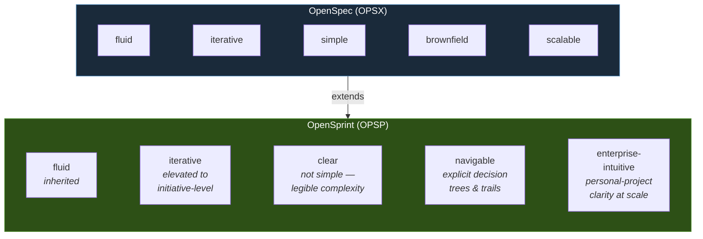

# OpenSprint Philosophy

## Where We Come From

OpenSpec established five principles:

```
→ fluid not rigid
→ iterative not waterfall
→ easy not complex
→ built for brownfield not just greenfield
→ scalable from personal projects to enterprises
```

OpenSprint inherits the first two. It respectfully diverges from the third. And it reframes the last two into something more ambitious.

---

## The OpenSprint Principles

```
→ fluid, not rigid
→ iterative, not waterfall
→ clear, not simple
→ navigable, not hidden
→ reasoned, not assumed
→ enterprise-intuitive, not enterprise-complicated
```

### Fluid, not rigid

Same as OpenSpec. The harness should adapt to how operators actually work — not force a ceremony that doesn't fit the problem. No mandatory sequence when a shortcut is safe. No bureaucratic artifact when a lightweight one suffices.

### Iterative, not waterfall

Same as OpenSpec. But OpenSprint extends what "iterative" means. In OpenSpec, one iteration is one change lifecycle — explore, propose, apply, archive. In OpenSprint, **iteration operates at the level of sprints, milestones, and initiatives**. Each OPSX cycle is a single heartbeat. OpenSprint manages the rhythm of many heartbeats across a coordinated effort.

```
OpenSpec iteration:   one change, one cycle
OpenSprint iteration: many changes, many cycles, one coherent initiative
```

### Clear, not simple

This is where we diverge.

OpenSpec optimized for simplicity — keep the overhead low, keep the learning curve gentle. That's right for a single-change workflow. But OpenSprint exists because the problems we're solving are not simple. Multi-domain systems, cross-team dependencies, compliance constraints, architectural trade-offs that ripple across services — these are inherently complex.

**We do not pretend complexity doesn't exist. We make it legible.**

A complex system managed through OpenSprint should feel like reading a well-organized book, not like navigating a maze. Every artifact has a reason. Every decision has a record. Every escalation has a trail. The complexity is real, but the structure makes it traversable.

```
Simple:    hide the complexity, hope it doesn't matter
Clear:     show the complexity, make it navigable
```

### Navigable, not hidden

Every operator should be able to answer these questions at any point:

- **Where am I?** — Which initiative, which milestone, which squad, which task.
- **How did we get here?** — The chain of decisions that led to this moment.
- **What's next?** — What's ready, what's blocked, and why.
- **What if we went differently?** — Which decision nodes could be revisited, and what would change downstream.

Nothing is buried. The decision tree is explicit. The artifact graph is walkable. The escalation history is traceable. An operator joining mid-initiative can reconstruct the full reasoning in minutes, not days.

### Reasoned, not assumed

Every architectural choice, every trade-off, every scope decision should have a recorded rationale — not because we love documentation, but because **reasoning is the most valuable engineering artifact that is routinely thrown away**.

Code can be regenerated. Tests can be rewritten. But the reasoning behind *why this approach and not that one* — once lost, it gets rediscovered the hard way, usually during an incident or a failed rewrite.

OpenSprint makes reasoning durable:

- **Decision records** capture what was chosen, what was rejected, and why.
- **Driver specs** capture the immutable intent — the *why* behind everything.
- **Review artifacts** capture what we learned, so future decisions are better informed.

This is the foundation of the decision tree model. When every node in the tree carries its rationale, you can:

- Revisit any past decision with full context
- Rebuild downstream from any node with different choices
- Train future agent personas on accumulated engineering judgment

### Enterprise-intuitive, not enterprise-complicated

The last OpenSpec principle — "scalable from personal projects to enterprises" — is a spectrum. OpenSprint takes a position on that spectrum:

**Enterprise-scale engineering should feel as intuitive as working on a personal project.**

Not because enterprise problems are simple. Because the mental model should be.

A personal project has a clear mental model: you know what you're building, why, and what's left. You hold the whole picture in your head. Enterprise projects lose this. The picture fragments across teams, tools, Jira boards, Slack threads, and tribal knowledge. Nobody holds the whole picture. Everyone navigates by partial maps and assumptions.

OpenSprint's ambition is to restore that clarity at scale:

```
Personal project:     one person, one mental model, total clarity
Enterprise project:   many people, fragmented models, partial clarity

OpenSprint promise:   many people, one navigable model, restored clarity
```

The operator of an OpenSprint initiative — whether managing 3 squads or 30 — should have the same feeling of "I know where everything is, I know why every decision was made, I know what's next" that a solo developer has on a weekend project.

This is not about dumbing things down. It's about making the structure so clear that complexity becomes manageable rather than overwhelming.

---

## How This Extends OpenSpec



| OpenSpec | OpenSprint | What changed |
|---|---|---|
| Fluid, not rigid | Fluid, not rigid | Same. No unnecessary ceremony. |
| Iterative, not waterfall | Iterative, not waterfall | Elevated. Iteration now spans initiatives and milestones, not just single changes. |
| Easy, not complex | Clear, not simple | Diverged. We embrace real complexity but demand it be legible. |
| Built for brownfield | Navigable, not hidden | Reframed. Every decision, escalation, and dependency is explicit and traversable. |
| Scalable to enterprises | Enterprise-intuitive | Sharpened. Enterprise-scale should feel as clear as a personal project. |

---

## The Insight Behind the Divergence

OpenSpec asks: *"How do we make spec-driven development easy enough that people actually do it?"*

OpenSprint asks: *"How do we make the entire engineering decision-making process so clear that AI agents can participate in it — and that humans can trust, navigate, and rebuild from it at any scale?"*

The answer isn't simplicity. The answer is **structural clarity**:

- A simple system hides what you don't need to see.
- A clear system shows you everything, organized so well that you only *look at* what you need.

When the structure is clear enough:

- An AI agent can make architectural decisions within well-defined authority boundaries.
- A human operator can review those decisions with full context, not blind trust.
- A future team can revisit any past decision node and rebuild differently — because the *why* was never lost, only the *how* was.

This is what makes the "rebuild over maintain" thesis possible. Not because rebuilding is free. Because **when reasoning is preserved, rebuilding is informed** — and informed rebuilding at AI speed is faster, cheaper, and more correct than maintaining a system whose original reasoning has been forgotten.
