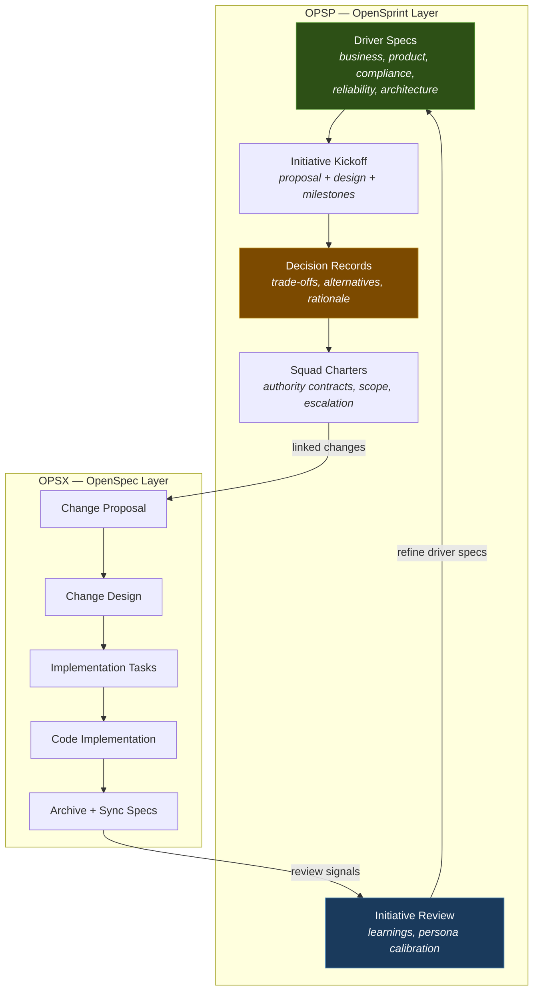
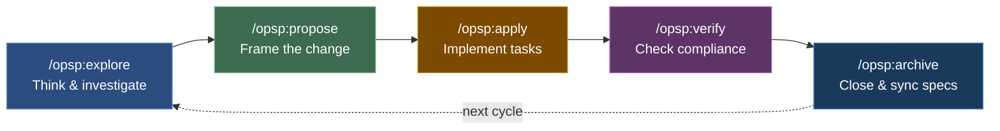
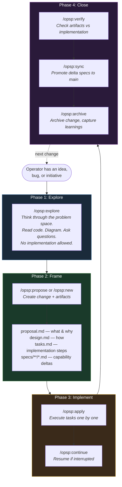
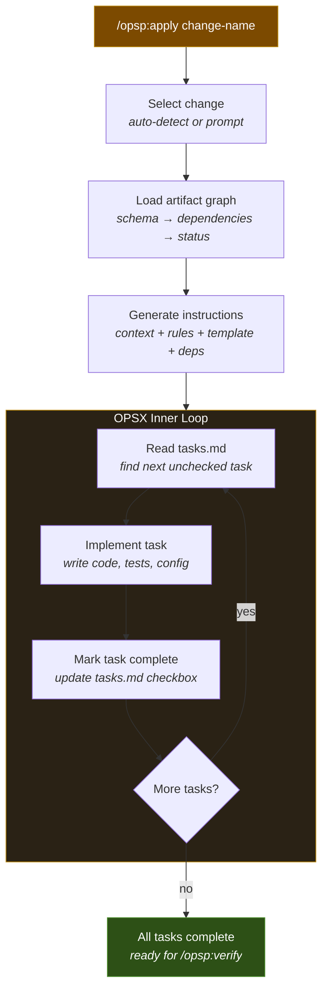
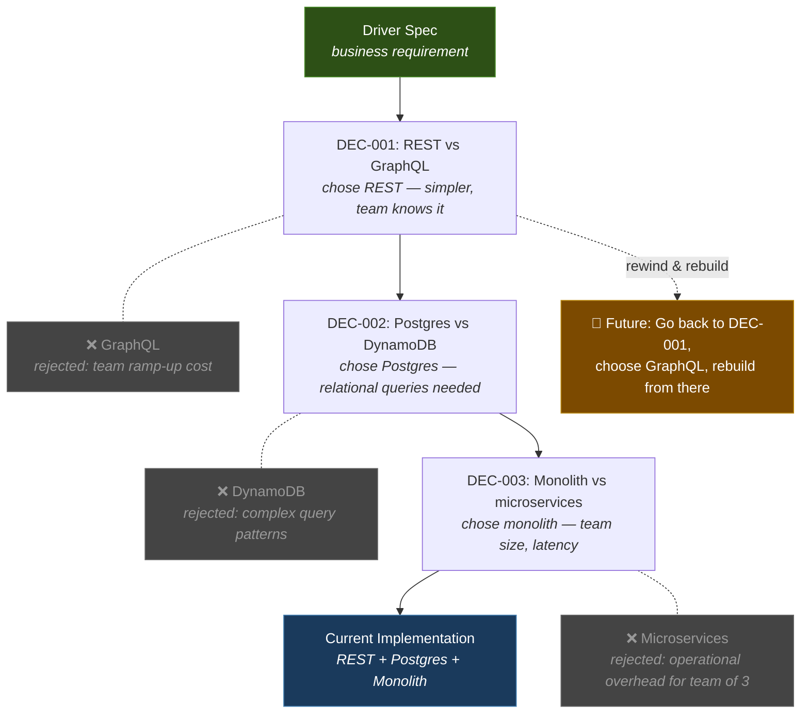
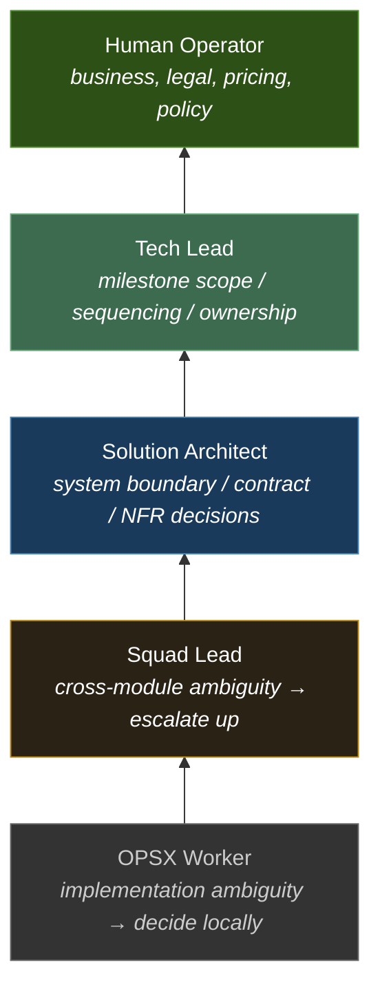

# OpenSprint (OPSP)

**A higher-order AI engineering harness for sprint and milestone orchestration.**

---

## The World Has Changed

Software engineering has been flipped upside down. AI coding agents now handle the low-level intelligence heavy-lifting — writing code, fixing bugs, refactoring modules. The bottleneck has shifted. The hard part is no longer *writing* software. It's *deciding what to write and why*.

Most engineering failures are not failures of implementation. They are failures of intent, judgment, and memory:

- Why was this built this way?
- What alternatives were rejected?
- What constraints drove this decision?
- Can we rebuild this differently without losing the original reasoning?

OpenSprint exists because the answer to all of these should be: **yes, always, by design.**

## The Core Idea: Event-Sourced Engineering Judgment

OpenSprint treats every engineering decision as a durable, replayable event — inspired by git's commit history and the event sourcing pattern.

```
Every decision is a fork in a universe of possibilities.
Every fork gets recorded.
The operator can go back to any node in the decision tree
and rebuild the entire solution from that point forward.
```

The artifacts OpenSprint produces are not documentation for humans to read after the fact. They are **machine-readable source-of-truth** that preserves:

- **Driver specs** — the immutable *why* (business, product, compliance, reliability, architecture)
- **Decision records** — the conscious *what and what-not* (trade-offs, alternatives, rationale, reuse conditions)
- **Initiative artifacts** — the structured *how* (proposals, designs, milestones, squad charters)

Because every train of thought, every rejected alternative, every trade-off rationale is captured as a first-class artifact, the system unlocks something radical:

> **You can rebuild an entire system that matches original intent, regardless of tech stack, solution architecture, or implementation choices — because all of those are simply byproducts of a working solution. The driver specs are the source of truth.**

## Why This Matters Now

In this new era, a provocative but increasingly true statement:

> **Refactoring or overhauling an entire system is simpler, cheaper, and often better than maintaining any existing system with design flaws at any severity.**

When AI agents can regenerate implementation from well-structured specs and decision records, the economics of software change fundamentally. The cost of "rewrite from scratch" approaches zero — *if and only if* the reasoning behind the original system is preserved.

OpenSprint is the harness that preserves it.

## Architecture: OPSP over OPSX

### Mental Model
```
┌──────────────────────────────────────────────────────────┐
│                     Human Operator                       │
│      sets intent, answers unresolved high-authority      │
│                     questions only                       │
└──────────────────────────────────────────────────────────┘
                           │
                           ▼
┌──────────────────────────────────────────────────────────┐
│                      open-sprint                         │
│                                                          │
│  Tech Lead Persona          Solution Architect Persona   │
│  - milestone framing        - system decisions           │
│  - squad coordination       - boundary validation        │
│  - sequence and risk        - cross-domain trade-offs    │
└──────────────────────────────────────────────────────────┘
                           │
                           ▼
┌──────────────────────────────────────────────────────────┐
│                    Squad Lead Personas                   │
│        each bound by a squad charter and authority       │
└──────────────────────────────────────────────────────────┘
                           │
                           ▼
┌──────────────────────────────────────────────────────────┐
│                         OPSX                             │
│              explore -> apply -> archive                 │
└──────────────────────────────────────────────────────────┘
                           │
                           ▼
┌──────────────────────────────────────────────────────────┐
│                    Repo-Local Changes                    │
│          code, tests, specs, review, archive             │
└──────────────────────────────────────────────────────────┘
```

OpenSprint (OPSP) is a higher-order orchestration layer built on top of OpenSpec (OPSX).

```
opsp  = tech lead + architect orchestration layer (decisions, initiatives, milestones)
opsx  = squad lead workflow layer (specs, changes, implementation)
repo  = implementation execution layer (code, tests, artifacts)
```



## Operator Day-to-Day: The OPSP Lifecycle

The typical operator workflow follows this cycle. Each box represents a slash command available in your AI coding agent via `/opsp:*`.



### Full Command Reference

| Command | Purpose | When to use |
|---|---|---|
| `/opsp:explore` | Thinking partner mode — investigate, clarify, reason | Before committing to any direction |
| `/opsp:propose` | Create a change with all artifacts in one step | Starting well-understood work |
| `/opsp:new` | Create an empty change scaffold | When you want to fill artifacts incrementally |
| `/opsp:continue` | Resume work on an existing change | Picking up where you left off |
| `/opsp:apply` | Implement tasks from a change | Ready to write code |
| `/opsp:ff` | Fast-forward — generate all artifacts and start implementing | When you want speed over deliberation |
| `/opsp:sync` | Merge delta specs back to main specs | After implementation, before archiving |
| `/opsp:archive` | Archive a completed change | Work is done and verified |
| `/opsp:bulk-archive` | Archive multiple changes at once | Housekeeping after a sprint |
| `/opsp:verify` | Verify implementation matches artifacts | Before archiving, quality gate |
| `/opsp:onboard` | Guided walkthrough of the full workflow | First-time users |

### Detailed Lifecycle: From Idea to Archive



### Inside OPSX: What Happens During `/opsp:apply`

When `/opsp:apply` runs, it delegates to the inner OPSX execution layer. Here's what the agent does inside that process:



## The Decision Tree: Engineering as a Multiverse Illustration

Traditional engineering treats decisions as invisible. You see the final code, not the reasoning. OpenSprint makes the decision tree explicit:



Every decision node is a point where an operator can say: *"What if we went the other way?"* and the system has enough context to rebuild the entire downstream path — because the **driver specs** (the *why*) haven't changed, only the architectural choices (the *how*).

## Future Vision: Higher-Order Agent Skills

To fully realize this vision, OpenSprint will train higher-level intelligence agent personas that automate decision-making to the extent possible while always aligning with driver specs:

### Migration Agent Skill

A critical enabler for brownfield projects at scale. The `migration` skill would:

- Assess existing systems against driver specs
- Reason about **backward compatibility feasibility** — not to always be backward compatible, but to make informed decisions between:
  - **Regret cost** — what we lose by not migrating
  - **Sunk cost** — what we've already invested that we'd abandon
  - **Migration cost** — the actual effort to transition
  - **Data migration** — schema evolution, transformation, backfill strategies
- Produce migration plans as first-class artifacts with decision records
- Consider coexistence strategies (strangler fig, blue-green, feature flags)

The purpose is never "always be backward compatible." It's about **making good decisions** about when to break, when to bridge, and when to rebuild — with full reasoning captured.

### Solution Architect Persona

Automated cross-domain reasoning that:

- Challenges assumptions before they become architecture
- Validates boundary decisions against driver specs
- Produces decision records for every non-trivial trade-off
- Maintains architectural coherence across squads

### Tech Lead Persona

Milestone-level orchestration that:

- Decomposes initiatives into sequenced squad work
- Manages dependencies and risk
- Aggregates review signals into initiative-level learnings

## The Escalation Ladder



Every meaningful escalation results in a **decision record** — making the judgment reusable, not just the code.

## Getting Started (PRIOR CLI READINESS)

### Install in your project

```bash
# Copy the .claude/ directory into your project
cp -r .claude/skills/ /path/to/your-project/.claude/skills/
cp -r .claude/commands/ /path/to/your-project/.claude/commands/

# Initialize the OpenSpec layer (if not already done)
opensprint init
```

### Your first cycle

```bash
# 1. Explore an idea
/opsp:explore "we need to add user authentication"

# 2. Propose the change (creates all artifacts)
/opsp:propose add-user-auth

# 3. Implement the tasks
/opsp:apply add-user-auth

# 4. Verify and close
/opsp:verify add-user-auth
/opsp:sync add-user-auth
/opsp:archive add-user-auth
```

## Philosophy

Inherited from OPSX.
```
→ fluid, not rigid
→ iterative, not waterfall
→ clear, not simple
→ navigable, not hidden
→ reasoned, not assumed
→ enterprise-intuitive, not enterprise-complicated
```

Ours
```
Decisions over code — code is regenerable, reasoning is not.
Event-sourced judgment — every fork in the decision tree is preserved.
Driver specs over architecture — architecture is a byproduct, intent is the source of truth.
Rebuild over maintain — when reasoning is preserved, rebuilding is cheaper than maintaining flawed designs.
Progressive disclosure — simple until you need complex.
Human-in-the-loop, not human-in-the-way — automate what you can, escalate what you must.
```

Read the full philosophy and how OpenSprint extends OpenSpec's principles in [PHILOSOPHY.md](PHILOSOPHY.md).

## License

MIT
